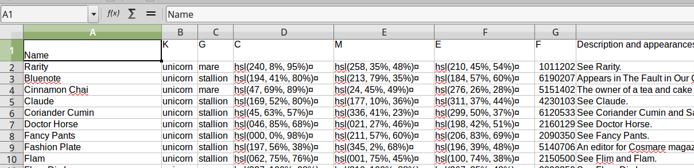

## scrape_ponies
> An exploration of Python's requests and Beautiful Soup modules using the My Little Pony: Friendship is Magic wiki as a playground to test out the various scraping facilities.

The MLP wiki is here: http://mlp.wikia.com/


transformed into this...




## Motivation
I wanted to dive into Beautiful Soup and scrapy while learning more about Python requests and HTML manipulation. Plus, it's just a side bonus that scraping MLP content is pretty amusing. From the mass amount of songs, transcripts, and character info, I could also start to use some data analysis to get some interesting introspection into the writing and patterns. 

For example, the character lists show exactly what time a character was introduced. From this we could create a timeline graph showing all the characters and when they first appeared, and overall see how often new characters are introduced!

## Examples of use
### Scrape a single MLP song
```
$ python mlp_song.py URL

example:
$ python mlp_song.py http://mlp.wikia.com/wiki/Smile_Song
```

### Details on every category from the MLP pony/character lists.
```
For help:
$ python ponylist.py -h

Example: Get just the names of all unicorns, clean the names, remove unnamed ponies, and display verbose output.
$ python ponylist.py unicorns -n -c -k -v
```

### Getting all MLP song lyrics
```
For help:
$ python all_mlp_songs.py -h
```

### Getting all MLP show transcripts 
```
For help:
$ python all_mlp_transcripts.py -h
```

### Getting all friendship lessons
```
For help:
$ python friendship_lessons.py -h
```


## Installation
Just Python 2 or 3.

## Contributors
Erik Lunna

## License
MIT Licence
